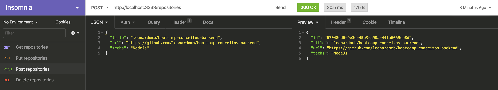
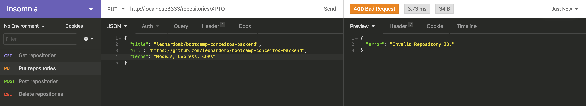
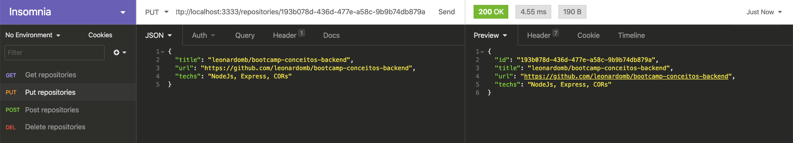
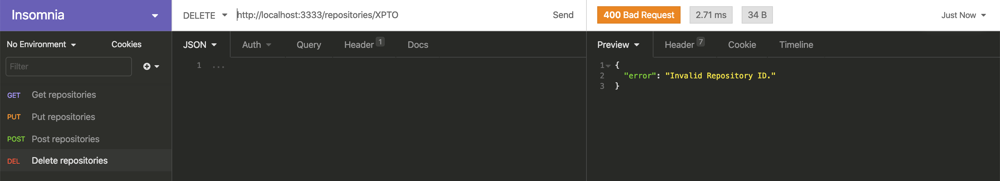
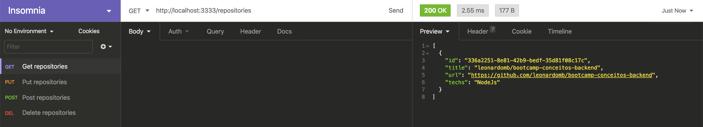
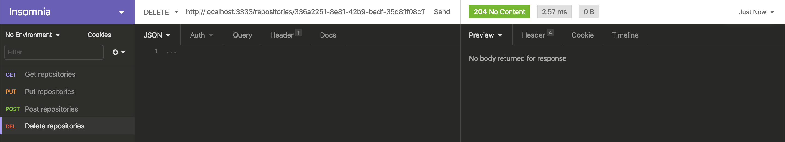
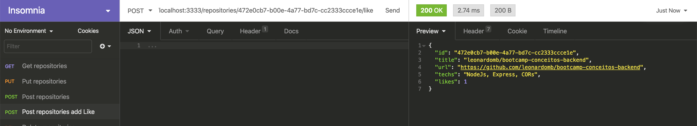
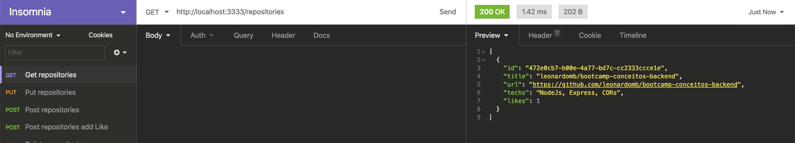
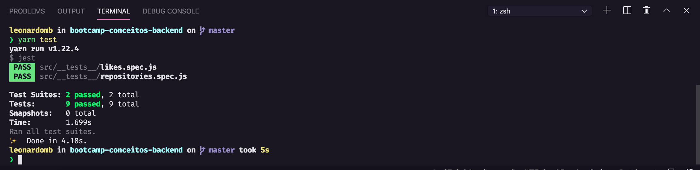

<h3 align="center">
  Entrega do desafio 02: Conceitos do Node.js
</h3>

  

  

  

## Sobre a entrega do desafio

Foi criada uma aplicação contendo os conhecimentos adquiridos até o momento no Node.js!

## Como testar?

Para clonar o repositório, clique no botão "Clone or download" e irá aparecer um menu. Copie a URL que aparece logo abaixo do botão.

No seu terminal, navegue até a sua pasta de preferência e rode o comando git clone {URL_DO_REPOSITORIO}, isso irá baixar todos os arquivos para a sua máquina.

Com seu repositório baixado na sua máquina, execute o comando yarn na pasta do projeto clonado para instalar todas as dependências.

Para rodar os testes execute o comando yarn test

## Evidências de testes locais

<h4>Post repositories</h4>

  

<h4>Get repositories</h4>

  

<h4>Put Invalid Repository ID</h4>

  

<h4>Put repositories</h4>

  

<h4>Get repositories after Put</h4>

  

<h4>Delete Repository not found</h4>

  

<h4>Delete Invalid Repository ID</h4>

  

<h4>Get repositories before Delete</h4>

  

<h4>Delete repositories</h4>

  

<h4>Post repositories add like</h4>

  

<h4>Get repositories after Post add like</h4>

  

<h4>Results local yarn test</h4>

  

## Licença

Esse projeto está sob a licença MIT. Veja o arquivo [LICENSE](LICENSE) para mais detalhes.

---

Power by Leonardo MB
